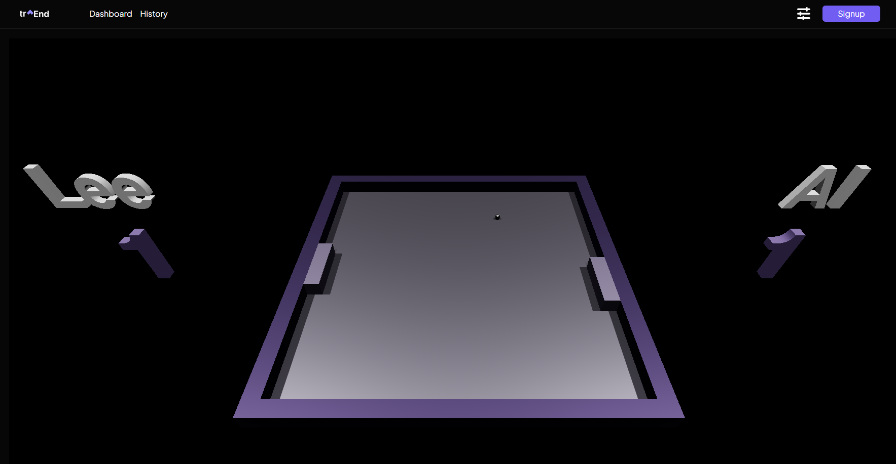
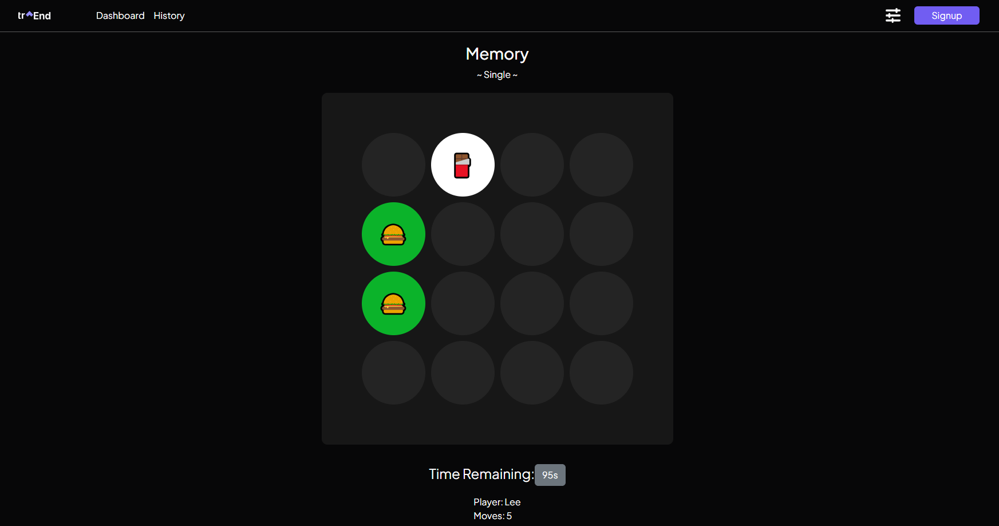

## Transcendence 

## Overview

Transcendence is a team project from the school 42. It requires building a web application where users can play a Pong game against others. This project utilizes `React`, `JavaScript`, `Python`, `Django`, `Docker`, and `Nginx`.

## Features

- 🛸 AI Opponent: Challenge an AI in the game.
- 🗿 Advanced 3D Techniques: Enhanced visual experience.
- 🕹 Game Modes:
  - Single Player
  - 1v1 Multiplayer
  - Tournament Mode
- 🎮 Additional Game: Includes a Memory game.
- 🌟 Browser Compatibility: Optimized for various browsers.
- 🌍 Multilingual Support: Available in multiple languages.
- 📊 User and Game Stats: Dashboards for detailed statistics.

## Getting started

```bash
git clone https://github.com/JideOgunlana/transcendence.git
```
1. Use the .env-example file to create a valid .env file.
2. Start the setup with make in the base directory.
3. Open https://localhost in your preferred browser (Chrome is recommended 😉).

## Screenshots




## Authors

<p>
Transcendence was created by <a href="https://github.com/TaleaX">TaleaX</a>, <a href="https://github.com/JideOgunlana">jide_O</a>, <a href="https://github.com/dantonik">dantonik</a>, and <a href="https://github.com/Sergi0Garcia">Sergi0Garcia</a>
</p>